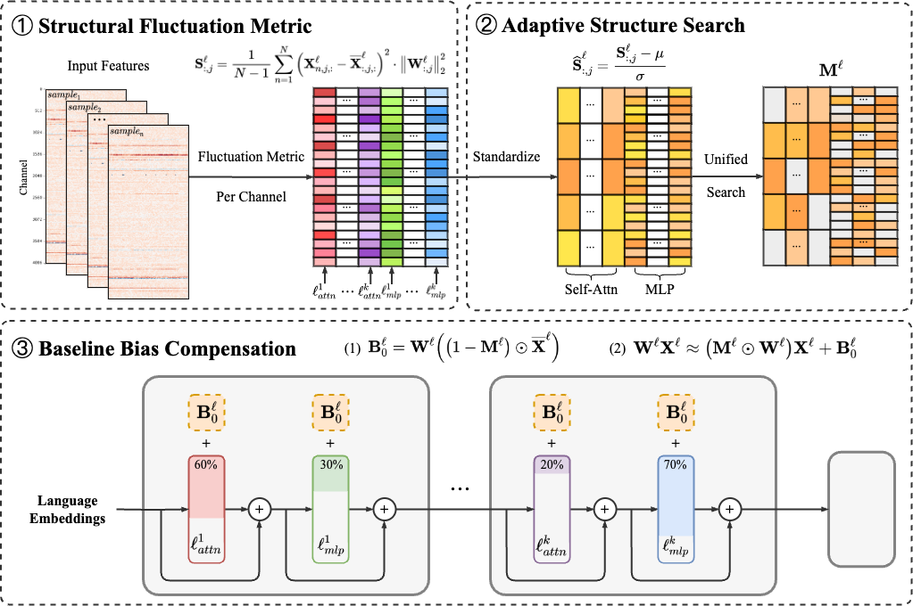
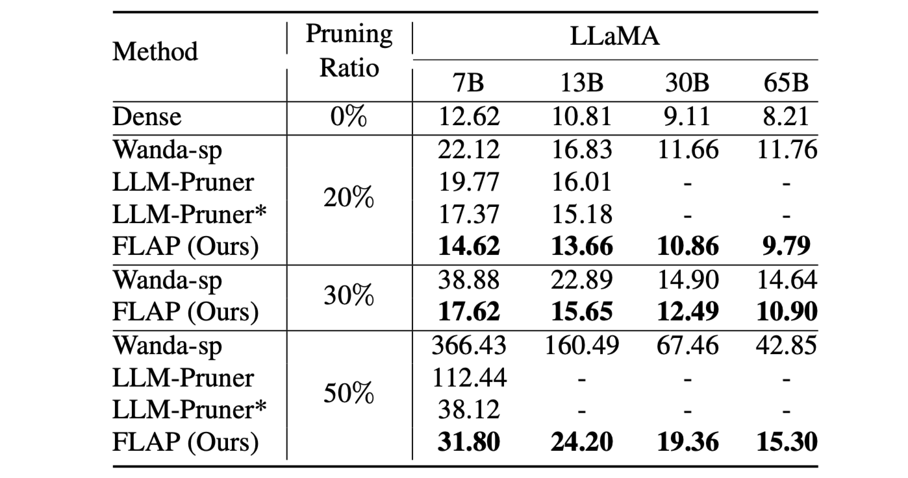
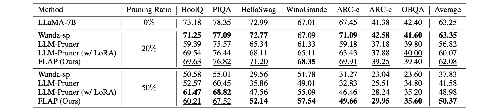

<p align="center">
 <br>
</p>

<div align="center">
<h1>FLAP</h1>
<h3>[AAAI 2024] Fluctuation-based Adaptive Structured Pruning for Large Language Models<h3>
</div>

<p align="center">
    
</p>


## Introduction
  
> **[Fluctuation-based Adaptive Structured Pruning for Large Language Models](https://arxiv.org/abs/2312.11983)** [[arXiv]](https://arxiv.org/abs/2312.11983)   
> *Yongqi An, Xu Zhao, Tao yu, Ming Tang, Jinqiao Wang*   
> *Institute of Automation, Chinese Academy of Sciences*  

#### Why FLAP: 
- [x] **No training required**: Our method can obtain a better compressed LLM without any retraining. 
- [x] **Adaptive compression structure**: Each module and layer has adaptive pruning ratio.  
- [x] **Efficient compression**: 3 to 5 minutes on a single GPU, with no additional time required.
- [x] **Better performance**: Better performance on a variety of language benchmarks, with additional gains in specific task datasets.

#### Supported LLMs:
- [x] [LLaMA Hugging Face](https://github.com/horseee/LLM-Pruner#1-pruning-discovery-stage--estimation-stage)
- [x] [Vicuna](https://github.com/horseee/LLM-Pruner#llama-vicuna-pruning)
- [ ] [Llama-2 Hugging Face](https://github.com/horseee/LLM-Pruner#1-pruning-discovery-stage--estimation-stage)
- [ ] [BLOOM](https://github.com/horseee/LLM-Pruner/tree/main/examples#cherry_blossom-bloom) 
- [ ] [Baichuan](https://github.com/horseee/LLM-Pruner/tree/main/examples#llama-baichuan-pruning)

## Table of Contents
  - [Quick Start](#quick-start)
  - [Configuration Instruction](#configuration-instruction)
  - [Language Modeling Evaluation](#language-modeling-evaluation)
  - [Zero-shot Evaluation](#zero-shot-evaluation)
  - [Acknowledgement](#acknowledgement)
  - [Citation](#citation)

## Quick Start

### Installation
Installation instructions can be found in [INSTALL.md](INSTALL.md).

### Minimal Example
```
bash script/llama_7b.sh $GPU_ID
```
This script would compress the LLaMA-7B model with ～20\% parameters pruned by FLAP. All the pre-trained models and the dataset would be automatically downloaded, so you do not need to manually download the resource. When running this script for the first time, it will require some time to download the model and the dataset.

    
## Configuration Instruction


### Pruning

**LLaMA-7B pruning with ~20% parameters pruned:**
```
python main.py \
    --model decapoda-research/llama-7b-hf \
    --prune_method flap \
    --pruning_ratio 0.2 \
    --remove_heads -1 \
    --metrics WIFV \
    --structure AL-AM \
    --nsamples 1024 \
    --save_model "llm_weights/flap_p0.2_WIFV_ALAM_llama_7b/" \
    --eval \
```
Arguments:
- `--model`: The identifier for the LLaMA model on the Hugging Face model hub. The model name is used for `AutoModelForCausalLM.from_pretrained` to load the pre-trained LLM. For example, if you want to use the LLaMA with 7 billion parameters, than pass `decapoda-research/llama-7b-hf` to `--model`.
- `--cache_dir`: Directory for loading or storing LLM weights. The default is `llm_weights`.
- `--prune_method`: We have implemented three pruning methods, as referenced in the paper, namely [`flap`, `wanda_sp`, `mag_sp`]. The default is `flap`.
- `--pruning_ratio`: Denotes the percentage of weights to be pruned.
- `--remove_heads`: How many heads should be removed, only used in `UL-MM` and `AL-MM` to manual the ratio of Self-attn and MLP.
- `--metrics`: The pruning metric to choose, as referenced in the paper, namely [`IFV`, `WIFV`, `WIFN`, `N/A`]. The default is `WIFV`.
- `--structure`: The global compressed model structure to choose, as referenced in the paper, namely [`UL-UM`, `UL-MM`, `AL-MM`, `AL-AM`]. The default is `AL-AM`.
- `--unstr`: Whether to true prune the model or only mask the weight, default is `False`.
- `--eval`: Whether to eval the model on Wikitext2 to calculate the perplexity, default is `False`.
- `--save_model`: Specifies the directory where the pruned model will be stored.
 
After pruning and post-training, we follow <a href="https://github.com/EleutherAI/lm-evaluation-harness">lm-evaluation-harness</a> for evaluation.
    

## Language Modeling Evaluation

A brief quantitative language modeling performance for LLaMA-family:

<p align="center">
 <br>
</p>

## Zero-shot Evaluation

A brief quantitative zero-shot performance results for LLaMA-7B:

<p align="center">
 <br>
</p>
    
More results can be found in the paper. 


## Acknowledgement
* Logo is generated by <a href="https://chat.openai.com/">DALLE·3</a>.
* The README.md: our README.md references <a href="https://github.com/horseee/LLM-Pruner">LLM-Pruner</a>, thanks to them for providing a readable and beautifully formatted README document.
* The evaluation of the LLM:  <a href="https://github.com/EleutherAI/lm-evaluation-harness">lm-evaluation-harness</a>.
* LLaMA: <a href="https://github.com/facebookresearch/llama"> https://github.com/facebookresearch/llama</a>.
* Vicuna: <a href="https://github.com/lm-sys/FastChat">https://github.com/lm-sys/FastChat</a>.

## Citation
If you find this project useful, please cite
```
@misc{an2023fluctuationbased,
      title={Fluctuation-based Adaptive Structured Pruning for Large Language Models}, 
      author={Yongqi An and Xu Zhao and Tao Yu and Ming Tang and Jinqiao Wang},
      year={2023},
      eprint={2312.11983},
      archivePrefix={arXiv},
      primaryClass={cs.CL}
}
```